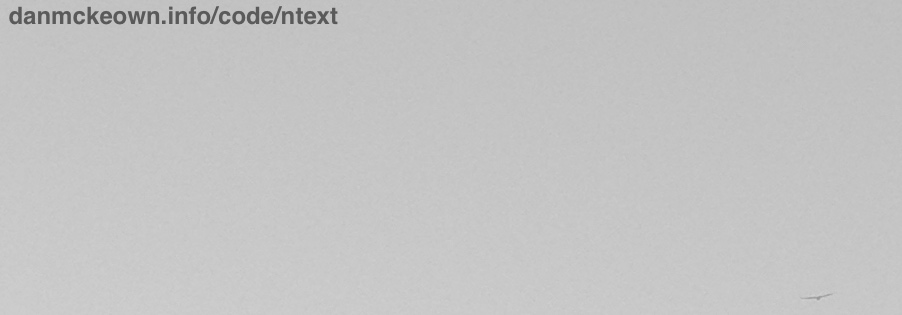

# ReadME for [nText](http://ntext.pacificio.com)

  

nText [henceforth ntext] is a text editor written in JavaScript by [Dan McKeown](http://danmckeown.info).  
ntext requires [NodeJS](https://nodejs.org/en/) 4+.
[AngularJS](https://angularjs.org/) and angular-route 1.5.x are also required and are currently included in the /client directory.

In order to set it up, make sure the code is unpacked in your file system.
The database will be stored in a [NeDB](https://github.com/louischatriot/nedb) database in the app directory at /db/ntext.json.

Now use your command line to go to the directory where the ntext code is.
Run this command to make sure you have your server-side dependencies:

`sudo npm install`

Now type in this to start the NodeJS server:

`sudo npm run start`

Once this is running, you can go to [local host 7387](http://localhost:7387) in your browser and use the ntext app to create and update texts and take advantage of the DOM clipboard.

Find out more in the [about file](client/assets/ntextAbout.md).
